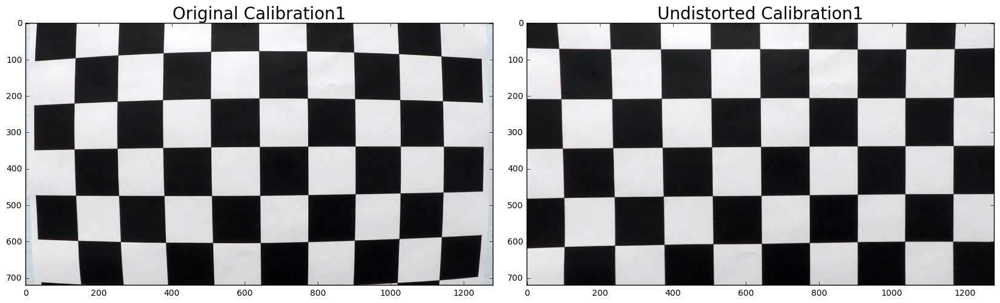
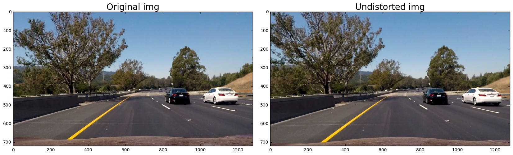
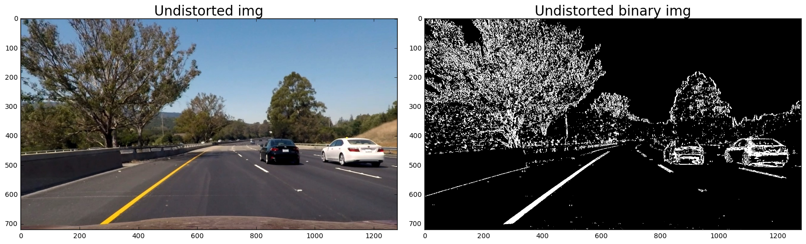
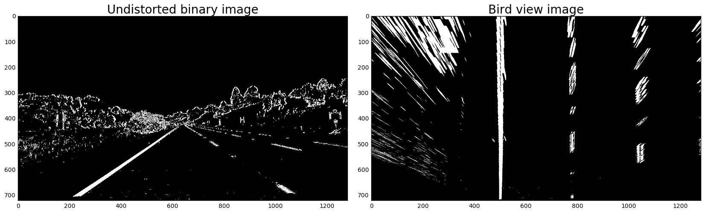
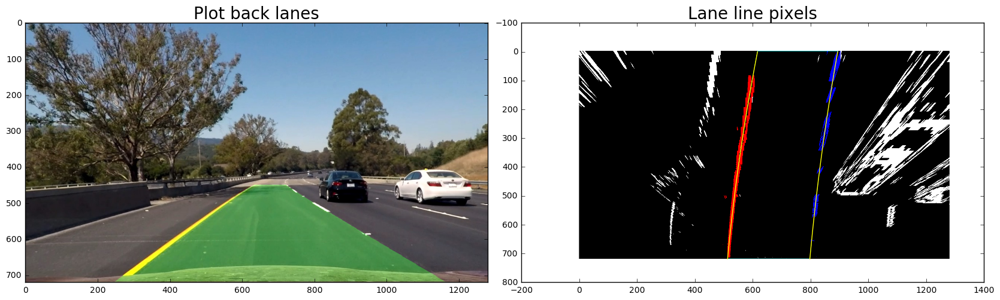

# Advanced Lane Finding Project

The goals / steps of this project are the following:

* Compute the camera calibration matrix and distortion coefficients given a set of chessboard images.
* Apply a distortion correction to raw images.
* Use color transforms, gradients, etc., to create a thresholded binary image.
* Apply a perspective transform to rectify binary image ("birds-eye view").
* Detect lane pixels and fit to find the lane boundary.
* Determine the curvature of the lane and vehicle position with respect to center.
* Warp the detected lane boundaries back onto the original image.
* Output visual display of the lane boundaries and numerical estimation of lane curvature and vehicle position.

---

## Rubric Points

### Here I will consider the rubric points individually and describe how I addressed each point in my implementation.

## Writeup / README

1. Provide a Writeup / README that includes all the rubric points and how you addressed each one. You can submit your writeup as markdown or pdf. Here is a template writeup for this project you can use as a guide and a starting point.

As this .md file!

## Camera Calibration

### 1. Briefly state how you computed the camera matrix and distortion coefficients. Provide an example of a distortion corrected calibration image.

The code for this step is contained in the first code cell of the IPython notebook located in the 1st and 2nd coding cell in "advanced.ipynb" .

I start by preparing "object points", which will be the (x, y, z) coordinates of the chessboard corners in the world. Note these are 9x6 chessboard images. Here I am assuming the chessboard is fixed on the (x, y) plane at z=0, such that the object points are the same for each calibration image. Thus, objp is just a replicated array of coordinates, and objpoints will be appended with a copy of it every time I successfully detect all chessboard corners in a test image. imgpoints will be appended with the (x, y) pixel position of each of the corners in the image plane with each successful chessboard detection.

I then used the output objpoints and imgpoints to compute the camera calibration and distortion coefficients using the cv2.calibrateCamera() function. I applied this distortion correction to the test image 'Calibration1' using the cv2.undistort() function and compared it with the original image, below is the result I obtained.

## Pipeline (single images)

### 1. Provide an example of a distortion-corrected image.

The code for this step is contained in the first code cell of the IPython notebook located in the 3rd coding cell in "advanced.ipynb" .

With the camera calibration and distortion coefficients obtained above, I applied the cv2.undistort() function to all the test images, and saved the results in the output_images folder with prefix 'undist'. Here I showed an example to compare the original and undistorted image of 'test6.jpg' as below.

### 2. Describe how (and identify where in your code) you used color transforms, gradients or other methods to create a thresholded binary image. Provide an example of a binary image result.

I used a combination of color and gradient thresholds to generate a binary image (in the 4th coding cell "advanced.ipynb"). For the gradient, I use the 'cv2.Sobel()' to compute the gradient of the gray image, and then cacluated the absolute and normalized the scale of gradient to 255. For the color, I convert the image to HLS color space and separate the S channel. The thresdhold I used for S channel was 170 to 255, for Sobel gradient was 20 to 100. I saved all the binary image result to the output_images folder with prefix 'undist-binary-'. Here's the output of 'test6.jg' for this step.

### 3. Describe how (and identify where in your code) you performed a perspective transform and provide an example of a transformed image.

The code for my perspective transform includes a function called warped(), which appears in 5th coding cell in the file "advanced.ipynb". The warped() function takes as inputs an image (img), as well as source (src) and destination (dst) points. Here I assume the road is a flat plane and investigate the image 'straight_lines1.jpg' where the lane lines are straight, and manullay find four points lying along the lines that, after perspective transform, make the lines look straight and vertical from a bird's eye view perspective. The src points I found were [[205, 720], [1107, 720], [596, 450], [685, 450]], and coresponding dst points were [[500, 720], [780, 720], [500, 0], [780, 0]]. The warped() function will return the warped image, the perspective transform M as well as the inverse perspective transform Minv. I saved all the warped image result to the output_images folder with prefix 'undist-binary-warped'. By checking the result of the two straight line image, I can comfirm the function working as expected and its warped the lines appear parallel in image 'straight_lines2.jpg'. Here's the output of 'straight_lines2.jpg' for this step.

### 4. Describe how (and identify where in your code) you identified lane-line pixels and fit their positions with a polynomial?

The code for identifing lane-line pixels includes a function called 'find_lanes', which appears in 6th coding cell in the file "advanced.ipynb". First, I take a histogram along all the columns in the lower half of the image. With this histogram I am adding up the pixel values along the column in the image. I'm not doing the whole column, instead, based on the measurement on the bird view images, I find the leftx_base and rightx_base always appeared on certain x-section, so I define a section on x-axis for searching the leftx_base and rightx_base, in my case it's 450 to 850. The two most prominent peaks found by the function np.argmax() in the 450 to 850 section of the histogram will be good indicators of the x-position of the base of the lane lines. They were used as a starting point for where to search for the lines. Then I used a sliding window, placed around the line centers, and follow the lines up to the top of the frame. The number of sliding windows I used was 9. I set the number for both 'margin' and 'minpix' as 30. The 'margin' is the margin width of the sliding window, while 'minpix' defined the minimum number of pixels found to recenter the window. For each window sliding, first use current center +/- margin as the left side and right side of the window, then use cv2.rectangle to draw the windows on the image and identify the nonzero pixels in x and y within the window, finally append these indices to the lists and recenter next window on their mean position if found > minpix pixels. The 'find_lanes' function will return the two lists of indices for the left and right line.

The code to fit the positions of the lines with polynomial could be found in 8th coding cell. With the list of indices obtained from find_lanes() function, the polynomial lines were computed by the function np.polyfit(). 

### 5. Describe how (and identify where in your code) you calculated the radius of curvature of the lane and the position of the vehicle with respect to center.

The code to calculate the radius of curvature of the lane and the position of the vehicles could be found in 8th coding cell. In order to get the measurement in meter, the pixels were transfered to meters first by 'ym_per_pix = 30/720, xm_per_pix = 3.7/700' and re-polyfited. The radius of curvature of left and right lanes were then calculated by 

left_curverad = ((1 + (2*left_fit_cr[0]*y_eval*ym_per_pix + left_fit_cr[1])**2)**1.5) / np.absolute(2*left_fit_cr[0])

right_curverad = ((1 + (2*right_fit_cr[0]*y_eval*ym_per_pix + right_fit_cr[1])**2)**1.5) / np.absolute(2*right_fit_cr[0])

In order to find the position of the vehicle with respect to center, I assume the offset of the lane center from the center of the image (converted from pixels to meters) is the distance from the center of the lane and calculated as 

offset_from_center = ((right_fitx[np.argmax(ploty)] + left_fitx[np.argmax(ploty)])/2 - 640) * xm_per_pix

### 6. Provide an example image of your result plotted back down onto the road such that the lane area is identified clearly.

The code to plot back the image down onto the road was cv2.warpPerspective() using the inverse perspective transform Minv.
I saved all the lane line pixel and plot back lines result to the output_images folder with prefix 'lane-line-pixels' and 'plot-back-lanes' respectively. I also showed the output of 'test6.jg' for this step.

    

## Pipeline (video)

### 1. Provide a link to your final video output. Your pipeline should perform reasonably well on the entire project video (wobbly lines are ok but no catastrophic failures that would cause the car to drive off the road!).

The pipeline function was defined as below. I also created a Line() class, which carries the information of the weighted coefficient over the the last iterations. In the piepline I uses a cv2.addWeighted() function to average the current polynomial coefficient with the past polynomial coefficient by weight. The purpose of doing the weighted average was to make the polylines looks more smooth between over different frames. After the video was processed by the pipeline() function, it was saved as '[project_video_output.mp4](project_video_output.mp4)' which could be found in the folder.  

<video width="960" height="480" controls>
  <source src="project_video_output.mp4">
</video>

## Discussion

### 1. Briefly discuss any problems / issues you faced in your implementation of this project. Where will your pipeline likely fail? What could you do to make it more robust?

1. One simple issue which however took me a long time to fix cv2.imwrite() function. This function just like the cv2.imread() function, will only take the BGR format image. If by any case it was feed by the RGB format image, the image output color would seem different.

2. The pipeline would very likely to be failed if the lane-line pixels couldn't be identified very well, especially in the video when the car passes the shade of the trees or there is some road color change. At the beginning I was trying to fix the problem by adjusting the threshold of the binary image. I expanded or shrink the threshold for the s channel or the sobelx gradient. The result turned out to be improved very little though. So I still keep using the (170, 255) for s channel and (20, 100) for sobelx. Then I tried searching within a window around the previous detection, as the lanes at the beginning of the video are easily to be identified, I believed if the frames after that would always follow the previous one, then the identified lane of the whole video would not deviate off the course. However, this idea actually still didn't work because once the lines were lost in some bad frame, all its following frames would fail. Finally, I tried to define a section on x-axis for searching the leftxbase and rightxbase, in my case it's 450 to 850. The two most prominent peaks found in the 450 to 850 section of the histogram will be more accurate indicators of the x-position than in the whole column. They were used as a starting point for where to search for the lines. This time the output of the video was improved a lot. Then I also adjusted the margin for the sliding window and minpixel number for re-centering the window. These two numbers were very important for identifying the lane pixels correctly, as they can eliminate most interference from the road color change or tree shade. 

3.  In order to make the identified lines look more smooth in the video, I uses a cv2.addWeighted() function to average the current polynomial coefficient with the past polynomial coefficient by weight. A Line() class was created to carry the information of the weighted coefficient over the the last iterations.

4.  In the method, I created a Line() class but only use it for keeping track of the polynomial coefficients averaged over the last n iterations. If I could track more previous x and y numbers and line coefficients, I believe there is some way to use them to make improvement to the pipeline. 

5. I tried searching within a window around the previous detection in order to solve the problem of deviating off the course, and it doesn't work. However, I believe it is a good method to avoid searching for the line pixels by sliding window in every frame. 

6.  Obviously there is more work I can do to improve the pipeline such as 4 and 5 I just mentioned above and it will take some time. Due to the limited time I have to submit my project first and will explore more in the future.  